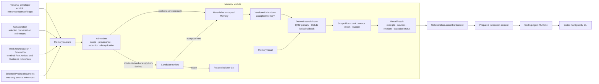

# Memory Module Design

> Status: **Canonical target-module draft — under design review**
> Created: 2026-07-27
> Scope: durable Personal/Project Memory, candidate admission, recall,
> correction, provenance, indexing and degraded operation.
> Main structural reference:
> [Waku Agent Memory](../../research/references/waku-agent-memory-reuse-assessment.md).
> Mechanism evidence:
> [Memory implementation alternatives](../../research/references/memory-implementation-alternatives.md)
> and
> [Tool, Skill and Memory assessment](../../research/references/tool-skill-memory-adoption-assessment.md).

## 1. The complete design in one sentence

Chymia Memory turns selected user statements, Project documents and completed
execution records into scoped, inspectable and source-backed knowledge; stores
accepted knowledge as human-readable versioned files; builds a replaceable
search index over those files; and returns bounded recall to Collaboration when
it assembles context for a later Coding Agent Invocation.

This is one Module with one Interface. Waku, Clowder, Letta and QMD are not four
runtime Modules that callers must coordinate. They explain where particular
parts of the internal design came from.

## 2. Integrated architecture



The end-to-end flows are:

```text
capture:
durable source reference
  -> scope and provenance checks
  -> redaction and duplicate check
  -> direct acceptance or Candidate
  -> accepted Markdown revision
  -> Git revision
  -> derived index generation

recall:
Context Request
  -> Personal + current Local Project scope
  -> QMD hybrid search
  -> source/revision validation
  -> bounded excerpts
  -> Collaboration Context Snapshot
  -> prepared Codex/Antigravity Invocation
```

No caller individually operates Markdown, Git, QMD, SQLite or a model
extractor. That integration is the Memory Implementation.

## 3. Meaning, responsibility and exclusions

`Memory` is an established agent-system mechanism used here as a Module name.
It is not a new Chymia domain object and does not enter the ubiquitous-language
glossary.

The Module is responsible for:

- Personal and Local Project Memory scopes;
- admission of new durable knowledge;
- Candidate extraction and review state;
- accepted Memory content and revision history;
- provenance and source references;
- correction, supersession and withdrawal;
- search-index generation and health;
- bounded, source-backed recall;
- visible degraded operation and rebuild.

It is not responsible for:

- raw Thread ordering or full conversation history — Collaboration maintains
  those facts;
- Thread, Run or Agent Invocation lifecycle — Collaboration maintains Thread
  state and Work Orchestration maintains execution state
  those facts;
- CLI Session continuity or prompt delivery — Coding Agent Runtime maintains
  Session/runtime facts and receives prepared context;
- Result Contract verdicts — Evaluation maintains those facts;
- executable Skill instructions — Skill design remains separate;
- authorization of Tool calls or external side effects;
- the contents of Project documents — the Local Project remains authoritative
  for those files.

### Why this is a Module

If Memory were deleted, provenance checks, project isolation, candidate review,
redaction, versioned files, indexing, ranking, context budgets, correction and
degraded recovery would spread across Collaboration, Work Orchestration, UI,
MCP Tools and every CLI Adapter.

The Interface has Depth because four operations hide the entire formation,
storage, retrieval and recovery lifecycle. This gives Leverage to context
assembly, the UI and execution finalization while keeping changes and bugs
local to one Implementation.

## 4. What is and is not Memory

| Material | Meaning | Durable Memory? | Source of truth |
|---|---|---|---|
| Working Context | Bounded material prepared for one Agent Invocation | No; disposable snapshot | Collaboration Context Snapshot plus referenced Modules |
| Conversation facts | User and agent-visible Thread history | No; potential source | Collaboration |
| Run/Invocation records | What execution was attempted and what happened | No; potential source | Work Orchestration |
| Result Artifact/Evidence | Concrete result and verification material | No; potential source | Evaluation and artifact storage |
| Project document | File already maintained in a Local Project | Searchable source, not copied truth | Local Project |
| Memory Candidate | Proposed fact or experience not yet admitted | No | Memory |
| Accepted Memory | Durable fact, preference, decision or useful experience admitted by policy/user decision | Yes | Memory's versioned Markdown |
| Search index | Retrieval structure over accepted Memory and selected source documents | No; rebuildable | Derived by Memory |
| Skill | Versioned instructions for repeatable work | No; separate responsibility | Skill catalog/design |

This separation prevents raw chat, a model summary, an index row and an
executable Skill from becoming four competing forms of “memory.”

## 5. Memory content and scope

Accepted Memory has two content kinds:

| Kind | Meaning | Example |
|---|---|---|
| Fact | A stable preference, constraint, decision or Project fact expected to remain useful | “Use pnpm for this Project”; “the user prefers concise review summaries” |
| Experience | A dated, source-backed account of an attempt and its reusable lesson | “Run R42 failed because Windows ConPTY was unavailable; the non-PTY fallback was verified” |

`Procedure` is deliberately excluded. A repeatable procedure may be proposed to
the separate Skill responsibility, but Memory cannot silently promote it.

Every accepted item has exactly one scope:

- **Personal scope**: an explicitly attributable user preference that may be
  recalled across Local Projects;
- **Project scope**: a fact, decision or experience associated with exactly one
  stable Local Project identity.

Thread, Run and Invocation identifiers are provenance references, not Memory
scopes. Recall never searches another Local Project merely because two Threads
contain similar words.

## 6. State uniquely maintained by Memory

| State | Meaning | Persistence | Created by | Changed by | Observed by | Recovery rule |
|---|---|---|---|---|---|---|
| Memory Candidate | Proposed Fact/Experience plus scope, source references, extraction policy and review state | SQLite with immutable source references and version | `capture` after admissible source intake | `decide` | Personal Developer, audit views | Re-run extraction only with the same idempotency identity or create a new Candidate version |
| Accepted Memory item | Current accepted content, kind, scope, provenance and status | Versioned Markdown in a dedicated local Git repository | Direct explicit-user admission or accepted Candidate | `decide` correction/supersession/withdrawal | `recall`, `browse`, Personal Developer | Git revision and decision record reconcile; no search row can recreate missing accepted content |
| Memory revision | Immutable record of an accepted change and its prior revision | Git commit plus SQLite decision/materialization record | successful materialization | never mutated | audit and recovery | Incomplete materialization is reconciled by idempotency marker and expected prior revision |
| Source registration | Stable reference, digest, selection rule and last observed revision for an indexed Project document or external Module fact | SQLite | `capture` | later observation with expected version | index builder, browse | Changed source invalidates derived chunks; original Module/file remains authoritative |
| Admission decision | Accepted, rejected, corrected, superseded or withdrawn decision with principal/policy version | SQLite | `decide` or explicit-user policy | never rewritten; later decision supersedes | UI, audit, materializer | Reconcile materialization from decision intent; never infer a decision from an index |
| Index generation | Last complete generation, source revisions and health | SQLite metadata; QMD/SQLite index data is derived | successful index build | rebuild/incremental index | `recall`, diagnostics | Serve last complete valid generation or lexical/file fallback; rebuild from accepted files and registered sources |
| Processing checkpoint | Idempotency identities and current extraction/materialization/index work | SQLite | `capture`/`decide` | internal worker with fencing/version checks | diagnostics | Expired work is reconciled before retry; no duplicate accepted revision |

The accepted Markdown content plus its Git revision is the durable knowledge
record. SQLite is authoritative for Candidate, decision, processing and index
health facts. QMD and SQLite search tables are derived retrieval data.

This is not a “keep two truths synchronized” design:

- a Markdown/Git revision proves accepted content;
- a SQLite decision proves why that revision was requested;
- an index generation only proves what searchable projection was built.

## 7. Interface

```ts
interface Memory {
  capture(input: MemorySourceInput): Promise<CaptureReceipt>;
  recall(request: RecallRequest): Promise<RecallResult>;
  decide(command: MemoryDecision): Promise<DecisionReceipt>;
  browse(query: MemoryQuery): Promise<MemoryPage>;
}
```

### 7.1 `capture`

The caller supplies:

- stable Personal or Local Project scope;
- immutable source references and source revisions/digests;
- source kind: explicit user statement, conversation selection, terminal
  execution result, Evaluation reference or selected Project document;
- principal/provenance;
- idempotency key.

The result is one of:

- a registered searchable source;
- an accepted Memory revision for an explicit user instruction;
- a Candidate receipt;
- a duplicate receipt;
- a typed rejection.

The caller does not decide whether model-derived text becomes accepted
knowledge. The Module applies admission rules:

- an explicit user instruction such as “remember this” is already a user
  decision and may be accepted after validation/redaction;
- agent-, model- and execution-derived claims become Candidates;
- selected Project documents remain source documents and are indexed without
  being copied into accepted Memory;
- secrets, unsupported sources and cross-scope references are rejected.

### 7.2 `recall`

The caller supplies:

- Personal scope inclusion and exactly one current Local Project scope;
- query assembled from the Thread objective, current request and allowed Thread
  context;
- excerpt/token/result budget;
- required source kinds and minimum accepted revision if pinned.

The result contains:

- bounded excerpts;
- Memory item or source-document identity;
- source references and accepted/index revisions;
- scope and content kind;
- rank/retrieval mode;
- omissions;
- `current`, `stale`, `lexical_fallback` or `unavailable` status.

An empty successful result differs from degraded/unavailable recall. Recall is
read-only, idempotent and has a bounded deadline. It never modifies access,
execution, Evaluation or acceptance state.

### 7.3 `decide`

The caller supplies:

- Candidate or accepted Memory identity;
- accept, reject, correct-and-accept, supersede or withdraw intent;
- expected version;
- principal and idempotency key.

The result contains:

- durable decision identity;
- materialization state;
- resulting Memory/Git revision when complete;
- index generation or explicit pending/stale status.

Only the Personal Developer or a previously accepted explicit policy may admit
model-derived content. A Coding Agent Tool call can create a Candidate; it
cannot accept, correct or withdraw Memory by itself.

### 7.4 `browse`

The caller supplies scope, status/kind filters, cursor and limit. The result
returns accepted items, Candidates, source references, revisions and health
without exposing QMD DTOs, vector identifiers, Git worktree details or SQLite
rows.

### Interface-wide rules

- Every state-changing request is idempotent.
- Scope is mandatory; no global unscoped search exists.
- Results are bounded and paginated.
- Source and revision information is part of every accepted item and recalled
  excerpt.
- Typed errors distinguish invalid scope/source, permission denial, version
  conflict, unavailable extractor, materialization conflict, stale index and
  total recall unavailability.
- The Interface is also the primary test surface.

## 8. Formation lifecycle

### 8.1 Explicit user Memory

```text
explicit user statement
  -> capture
  -> validate scope/source
  -> secret and content checks
  -> accepted decision
  -> Markdown patch + Git revision
  -> index update
  -> available for recall
```

The user is not asked to approve the same statement twice. If the content is
ambiguous about Personal versus Project scope, it becomes a Candidate requiring
clarification rather than guessing a broader scope.

### 8.2 Derived Memory

```text
terminal Invocation/Run + selected sources
  -> capture immutable references
  -> bounded extraction
  -> Candidate
  -> user/policy review
  -> accept | correct-and-accept | reject
  -> materialize accepted revision
  -> index update
```

Automatic extraction may batch several terminal records to control cost, as
Waku batches conversations, but batching never crosses Local Project scope and
never changes admission rules.

If no verified extractor is configured, automatic extraction is visibly
unavailable. Explicit user Memory and selected-document indexing continue to
work.

### 8.3 Correction and forgetting

```text
active accepted item
  -> corrected revision | superseded | withdrawn
```

History is retained. Recall excludes superseded/withdrawn content by default.
“Forget” withdraws the item from future recall and records the decision; source
records maintained by Collaboration, Work Orchestration or Evaluation follow
their own retention rules.

## 9. Recall lifecycle and working context

Memory is queried once while Collaboration builds the immutable Context
Snapshot for an Agent Invocation. Coding Agent Runtime does not query Memory
again during process execution.

```text
Work Orchestration requests prepared Invocation
  -> Collaboration selects allowed Thread/context facts
  -> Collaboration calls Memory.recall
  -> Memory searches Personal + current Project scope
  -> Memory validates source revision and applies budget
  -> Collaboration records excerpts/revisions in Context Snapshot
  -> Work Orchestration supplies prepared context
  -> Coding Agent Runtime starts Codex/Antigravity
```

The same Context Snapshot can be replayed without receiving newer Memory. A
later Invocation may use a later accepted/index revision, but the earlier
Invocation's effective context remains inspectable.

Waku's small-model retrieval gate is not a required extra call in the target.
The Memory Interface itself is always invoked at context assembly with a
bounded deadline. The Implementation may cheaply return no results for an
empty/self-contained query. Adding a model gate later requires measured
relevance and latency evidence; it is not part of the caller contract.

## 10. Internal seams and concrete Adapters

These seams are internal to the Memory Implementation. Other Modules depend
only on `Memory`.

| Internal seam | Production Adapter | Why it is real |
|---|---|---|
| accepted-content repository | Markdown files plus local Git | Human inspection, patch history and rollback differ from SQLite candidate/processing storage |
| search index | QMD local-process Adapter | Provides BM25, vector, hybrid retrieval and reranking without exposing its DTOs |
| degraded search | existing Chymia SQLite/FTS Adapter | A second real retrieval path used when QMD is unavailable or stale |
| source reader | typed readers for Collaboration/Evaluation references and confined Project documents | Sources have distinct authority and access rules |
| Candidate extractor | configured bounded model Adapter; absent Adapter reports unavailable | Model extraction is True external and optional; explicit-user capture does not depend on it |

Dependency classification:

| Dependency | Category | Design consequence |
|---|---|---|
| admission, scope, redaction, ranking budgets | In-process | hidden inside Memory |
| SQLite decision/checkpoint storage | Local-substitutable | verified through the Memory Interface with real temporary storage |
| Markdown and Git | Local-substitutable | dedicated local repository; no mutation of the user's Project is required |
| QMD process | Local-substitutable | health, timeout and restart are hidden; index remains rebuildable |
| configured extraction model | True external | failure creates no accepted knowledge and does not stop coding work |
| Project documents | Local data maintained outside Memory | read only through Project Access rules; content is never silently rewritten |

QMD's Node.js version and process lifecycle therefore do not leak into
Collaboration or Runtime. If QMD cannot start, Memory uses the lexical fallback
and reports degradation.

## 11. How the references form one design

| Reference | Role in the integrated target | What is not inherited |
|---|---|---|
| Waku Agent | Main structural reference: one Memory facade; working versus durable Memory; raw interaction retention; bounded history; threshold consolidation; recall; inspect/correct/delete; visible local state | Waku's Python Harness, personal-assistant-only scope, Skill-as-Memory, global consolidation and Anthropic-shaped client |
| Clowder | Admission rules: Candidates, provenance, secret scanning, materialization, rebuildable indexes and fail-open recall | federation, multi-user libraries, graph/entropy machinery and Clowder business semantics |
| Letta MemFS | Accepted-content mechanism: human-readable Markdown, patch/diff, local Git revision history and isolated background materialization | Letta Agent identity, autonomous self-rewriting and Letta Coding Agent Runtime |
| QMD | Retrieval mechanism: on-device BM25/vector/hybrid search, reranking and rebuildable index | authority over Memory content, candidate decisions or Chymia state |
| Current Chymia | SQLite/FTS, provenance-bearing Evidence data, bounded fail-open recall and real Context Assembly integration | pseudo-semantic query behavior, manual-upsert-only lifecycle and graph complexity as mandatory target |

The integration rule is:

> Waku supplies the shape; Clowder controls admission; Letta supplies the
> readable durable record; QMD supplies retrieval; Chymia supplies scope,
> authority, CLI context integration and recovery.

## 12. Inter-Module Interfaces

| Module | Memory receives | Memory returns | State rule |
|---|---|---|---|
| Collaboration | selected immutable conversation references and bounded recall query | recalled excerpts with sources/revisions | Memory does not copy or reorder Thread history; Collaboration decides what enters a Context Snapshot |
| Work Orchestration | terminal Run/Invocation references and capture request; prepared-context correlation | Capture Receipt and observable degraded status | Memory cannot transition Thread, Run or Invocation |
| Evaluation | Artifact/Evidence references through an authorized capture request | provenance references for later recall | recalled Memory cannot become Evaluation Evidence merely by being recalled |
| Project Access | stable Local Project identity and confined read access to selected documents | source registration/index health | Memory cannot authorize or widen Project access |
| Coding Agent Runtime | no direct call | no direct call; receives prepared context through Work Orchestration | Runtime cannot retrieve, write or approve Memory behind the Context Snapshot |
| Skill responsibility | optional indexed Skill description/reference only | no executable Skill content or promotion decision | Memory cannot create or authorize a Skill |
| Web/UI and Chymia MCP Tools | explicit user capture/review/browse requests with principal | receipts and views | UI/Tool projection cannot write storage directly |

## 13. Persistence and recovery

### Commit model

A decision and its materialization cannot share one atomic transaction across
SQLite, files and Git. The Module therefore uses a recoverable intent:

1. persist the decision and expected prior Memory revision;
2. create a deterministic materialization identity;
3. apply the Markdown patch only if the expected revision still matches;
4. commit with the materialization identity;
5. record the resulting Git revision;
6. request an index generation;
7. mark materialization complete.

After a crash, Memory checks the decision and Git history:

- matching commit found: record it and continue indexing;
- no commit found and expected revision still matches: retry safely;
- conflicting revision: return `materialization_conflict` for explicit review;
- index incomplete: serve the previous valid generation or lexical/file
  fallback with `stale` status.

Accepted Memory is never reconstructed from a model output cache or search
index.

### Rebuild

A complete rebuild reads:

- accepted active Markdown revisions;
- registered selected Project document revisions;
- scope and provenance metadata.

It produces a new index generation without changing accepted Memory. The old
complete generation remains readable until the new generation is committed.

## 14. Concurrency and idempotency

1. `capture` deduplicates by caller, scope, source revisions and idempotency key.
2. Candidate extraction obtains a durable processing claim for an exact source
   batch. Expired claims are reconciled before another worker proceeds.
3. Batches never cross Local Project scope.
4. `decide` uses expected Candidate/Memory version. Two conflicting corrections
   cannot both materialize.
5. Materialization is serialized per Memory scope and fenced by expected Git
   revision.
6. Index builds use generation identities. Recall only sees a complete
   generation.
7. Repeated explicit user capture returns the original receipt or proposes a
   correction when content differs; it does not create silent duplicates.
8. A repeated model extraction can update the same Candidate identity but
   cannot directly produce a second accepted item.

## 15. Permissions and safety

- Personal Memory requires an explicit user-attributable source.
- Project Memory capture and recall require the current Local Project identity.
- Cross-project recall is prohibited; only Personal Memory may accompany
  Project Memory.
- Tool output is bounded and redacted before Candidate extraction.
- Known secret forms and configured denied paths are rejected before storage or
  indexing.
- A recalled instruction cannot grant Tool, filesystem, tracker or network
  permission.
- A Coding Agent may request `capture`, but derived content remains a Candidate.
- Accepted Memory is untrusted context, not executable code.
- QMD and the extractor receive only the minimum scoped material required for
  the operation.

## 16. Failure and degraded modes

| Failure | User-visible result | Recovery |
|---|---|---|
| Memory Module unavailable during context assembly | Invocation may continue only with explicit `memory_unavailable` context metadata | retry later; no fabricated empty-success result |
| QMD unavailable | `lexical_fallback` with bounded SQLite/FTS results | restart/rebuild QMD |
| index stale | last valid generation plus `stale` and omitted revisions, or lexical/file fallback | finish/rebuild generation |
| extractor unavailable/rate-limited | source remains durable; Candidate extraction is pending/failed | finite retry or explicit user capture |
| extractor returns invalid/unsafe output | no Candidate or accepted item; typed extraction rejection | retain source and diagnostics |
| materialization conflict | accepted decision remains pending; old Memory stays active | user/reconciliation resolves expected revision |
| Git/file failure | no completed revision and no index update | reconcile deterministic materialization identity |
| source document changed | old chunks invalidated; recall excludes unverified stale excerpt | observe new digest and reindex |
| source Module reference missing | recalled item is withheld and integrity failure shown | restore source or explicitly revise/withdraw Memory |
| Candidate rejected | no accepted content/index entry | retain decision fact; no retry unless new source/revision |

Memory failure never changes Thread, Run, Invocation, Session or Evaluation
state. It changes only whether an Invocation received long-term recall, and that
fact remains visible.

## 17. Observability and audit

The Module records:

- Capture/Decision receipts and idempotency identity;
- scope and source references;
- extraction policy/model identity without storing secret credentials;
- Candidate and accepted revision transitions;
- materialization and Git revision;
- index generation and health;
- recall request correlation, scope, mode, hit identities, budget, omissions,
  latency and degraded status;
- correction, supersession and withdrawal.

It does not record full recalled secret-bearing excerpts in general telemetry.
The immutable Context Snapshot records the exact accepted excerpt identities
and revisions supplied to an Invocation.

## 18. Alternative Interfaces considered

| Design | Depth | Locality | Seam placement | State clarity | Error/test surface | Decision |
|---|---|---|---|---|---|---|
| Waku-shaped facade: `retrieve`, `matching_skills`, `log_chat`, `consolidate` | Deep inside one personal-assistant Harness | Good for Waku | Coupled to Session/prompt loop | Global facts/episodes; Skill mixed with Memory | Clear but lacks Project/concurrency semantics | Adapt structure, reject as Chymia Interface |
| Scope-aware `capture`, `recall`, `decide`, `browse` | High: hides admission, files, Git, index and recovery | All Memory behavior remains local | Between context/source Modules and Memory | Unique Candidate, accepted content, decision and index roles | Same small Interface supports production and recovery tests | **Recommended** |
| External memory product DTOs exposed directly | Depends on product; shallow for Chymia | Product details spread into callers | Network/MCP product seam leaks inward | External product may redefine scope/truth | Callers handle product outages and DTO drift | Reject |
| Put all Memory logic inside Collaboration context assembly | Low; context Interface grows with writes/review/indexing | Formation and retrieval mix with Thread logic | No independent Memory seam | Conversation and accepted knowledge compete | Hard to test correction/rebuild independently | Reject |

## 19. Current-to-target mapping

| Current area | Current actual responsibility | Evidence of actual use | Target responsibility | Decision | Rationale |
|---|---|---|---|---|---|
| `packages/api/src/evidence/sqlite-evidence-store.ts` | Evidence rows, FTS, vectors, entities/edges and search | Production composition and recall path `[CODE-CONFIRMED]` | degraded lexical index Adapter plus source/provenance migration input | Preserve behaviour | Local SQLite/FTS and provenance are useful; current schema is not the complete Memory lifecycle |
| `packages/api/src/context/evidence-recall.ts` | bounded fail-open recall during context assembly | Production context path `[CODE-CONFIRMED]` | Collaboration calls `Memory.recall` and records status/revisions | Preserve behaviour | Bounded non-blocking context enrichment is correct; silent `[]` must become visible degraded metadata |
| `/api/evidence/search` and Memory UI | manual search/browse | Registered route and UI `[CODE-CONFIRMED]` | `Memory.browse`/`recall` projection | Preserve behaviour | Human inspection is required; UI cannot depend on store rows |
| manual evidence upsert | direct creation of active Evidence | Registered route `[CODE-CONFIRMED]` | explicit user `capture` or Candidate flow | Replace | Direct writes bypass scope, admission, revision and provenance rules |
| entity/edge graph | entity and relation records | Store and tests; production value not proven | optional source/reference evidence only | Reference only | Graph machinery is not required for first complete Memory lifecycle |
| vector store and pseudo-semantic query | stored embeddings; query vector borrowed from lexical hit | Real search code `[CODE-CONFIRMED]` | QMD query embedding/hybrid search | Replace | Current behavior cannot perform general semantic retrieval |
| source scanners/materialization lifecycle | absent | `[CODE-CONFIRMED]` | Memory admission, materialization and index generation | Missing | Required to close formation and recovery |
| Project/Personal scope | absent from Evidence search truth | `[CODE-CONFIRMED]` | mandatory Memory scope | Missing | Prevents cross-project leakage |
| accepted Markdown/Git record | absent | `[CODE-CONFIRMED]` | durable accepted Memory | Missing | Required for inspection, correction and history |
| Waku Memory source | external reference only | fixed official revision `[REFERENCE]` | structural/lifecycle reference | Reference only | Coherent baseline but not a direct Chymia dependency |

## 20. Verification through the Interface

The Module is acceptable when tests and real diagnostics prove:

1. explicit Personal and Project Memory are stored, browsed, corrected,
   withdrawn and recalled across restart;
2. the same source/idempotency input does not create duplicate Candidates or
   accepted revisions;
3. model-derived execution content cannot bypass Candidate review;
4. two concurrent extractions/materializations cannot duplicate accepted
   content;
5. Project A content is never returned for Project B, including similar names,
   stale indexes and concurrent indexing;
6. accepted Markdown/Git content can rebuild every derived index from scratch;
7. QMD failure produces a lexical fallback with visible degraded status;
8. total Memory failure does not stop or falsely complete a Run;
9. a Context Snapshot pins exact Memory/source revisions and replays
   deterministically;
10. secrets and denied paths do not enter Candidates, files, indexes or recall;
11. extractor failure leaves source records intact and does not mark work
    processed;
12. a crash at every materialization step reconciles without a duplicate Git
    revision or lost accepted decision.

Fake extractor tests prove policy and bookkeeping only. Real QMD process tests,
real SQLite/Git recovery tests and at least one real Codex/Antigravity
Invocation receiving scoped Memory are required for usable status.

## 21. Definition of usable

Memory is usable when the Personal Developer can, through the real Chymia UI:

1. explicitly save a Personal or Project fact;
2. inspect its source and accepted revision;
3. run a real Codex or Antigravity coding task whose Context Snapshot contains
   the correct scoped Memory;
4. complete a Run and see any derived lesson remain a Candidate until accepted;
5. accept, correct or withdraw the Candidate without editing SQLite;
6. restart Chymia and retrieve the same accepted revision;
7. rebuild the search index from readable accepted files;
8. continue coding with visible degraded status when QMD or extraction is
   unavailable;
9. prove that another Local Project never receives the Memory;
10. proceed without manually repairing internal state after a failure.

An open UI tab, a fake extractor, a route returning 200, existing FTS tables or
successful unit tests do not satisfy this definition.

## 22. Open decisions

These do not block the Module shape:

1. Which bounded model/executable supplies automatic Candidate extraction. No
   automatic extraction is claimed complete until a real Adapter is verified.
2. Which Project documents are selected by default. The target requires an
   explicit, inspectable selection rule and denied paths.
3. The exact file partitioning inside the dedicated Memory Git repository.
   Callers and the Interface do not depend on it.
4. QMD process/version compatibility and measured Chinese retrieval quality.
   Failure must retain the specified lexical fallback.
5. Retention duration for rejected Candidates and withdrawn Memory. Withdrawal
   from recall is required regardless of retention policy.

No product decision is needed to choose the overall architecture: Waku is the
main structural reference, and Clowder/Letta/QMD mechanisms are integrated
inside one Chymia Memory Module.
