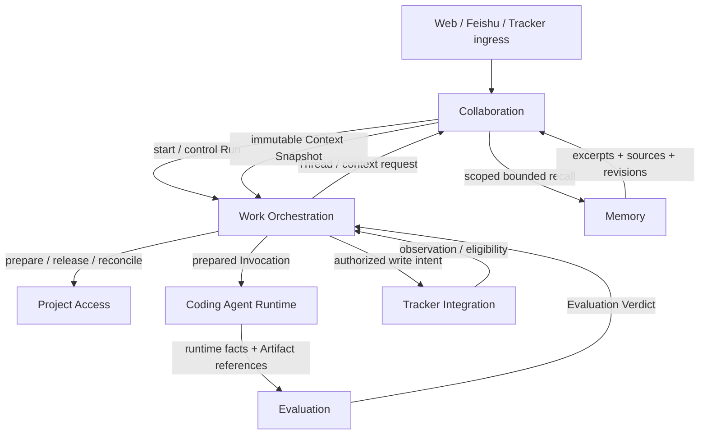

# Chymia Architecture Overview

> Status: **Canonical target draft — under design review**
> Last audited: 2026-07-27
> Scope: product scope, Module responsibilities, dependency direction, and
> cross-Module invariants. Detailed behavior belongs to the linked Module design.

## Architecture views

The committed diagrams are noncanonical explanatory views:

- [Current runtime view](CHYMIA_RUNTIME_ARCHITECTURE.png) and its
  [Excalidraw source](CHYMIA_RUNTIME_ARCHITECTURE.excalidraw).
- [Target architecture view](CHYMIA_TARGET_ARCHITECTURE.png) and its
  [Excalidraw source](CHYMIA_TARGET_ARCHITECTURE.excalidraw).

The Module map and Module designs below remain authoritative when a diagram is
older or less precise.

## Product scope

Chymia is a local control platform for one Personal Developer operating Coding
Agent CLIs against trusted local projects. It turns one coding objective into
durable, inspectable, permission-bounded work with explicit evaluation and
human acceptance.

A Thread is Chymia's persistent top-level record for one coding objective,
collaboration history, participants and human acceptance. A Thread may contain
multiple bounded Runs. When work originates from an external Issue, Chymia
maintains the Thread and execution facts while the tracker maintains the Issue.
Codex and Google Antigravity CLI are the target default agent executors.

Chymia is not a multi-tenant SaaS, a model host, a generic workflow language, a
clone of Clowder, or a bidirectional mirror of an issue tracker.

## Confirmed Modules

These directories are based on unique authoritative state and stable
Interfaces, not merely on nouns found in an earlier design.

| Module | Authoritative state | Interface offered to other Modules |
|---|---|---|
| [Work Orchestration](work-orchestration/design.md) | Run, Invocation, Command Receipt, Dispatch Claim, retry/reconciliation state, Authorization Grant and effect/outbox record | Submit a state-changing execution command; inspect immutable Run views; ingest verified facts |
| [Collaboration](collaboration/design.md) | Thread coding objective, conversation facts, participants, bounded Worklist and Thread Acceptance | Create/read a Thread; append collaboration facts; assemble bounded agent context; record accept/revise/abandon |
| [Memory](memory/design.md) | Memory Candidate, accepted Personal/Project Memory, admission decisions, revisions, source registrations, processing checkpoints and index-generation health | Capture source references; recall bounded scoped knowledge; decide admission/correction/withdrawal; browse |
| [Coding Agent Runtime](coding-agent-runtime/design.md) | Session, Session-use generation and persisted runtime-handle facts | Discover, start, cancel and reconcile one real Coding Agent CLI |
| [Project Access](project-access/design.md) | Local Project registration, prepared access generation and preparation/cleanup outcome | Register a Local Project; prepare, observe, release and reconcile confined access |
| [Evaluation](evaluation/design.md) | Result Contract clauses/version, Result Artifacts, Evidence and Evaluation Verdict | Evaluate pinned contract against artifacts and repository gates |
| [Tracker Integration](tracker-integration/design.md) | Issue Observation, observed revision, External Issue Binding and eligibility decision | Observe/refresh tracker facts; translate eligible observations; execute authorized writer operations through an Adapter |

### Module qualification

| Module | Deletion test | Depth / leverage |
|---|---|---|
| Work Orchestration | lifecycle, idempotency, claims, retry and recovery spread into every ingress and callback | two work-intent operations hide the complete durable lifecycle |
| Collaboration | ordering, membership, Worklist progress, context selection and replay spread across UI, ingress and Runtime preparation | one append/read/context Interface serves every collaboration caller |
| Memory | admission, provenance, scope isolation, versioned knowledge, indexing, correction and degraded recall spread across context assembly, UI and execution finalization | four operations hide the complete formation, storage, retrieval and recovery lifecycle |
| Coding Agent Runtime | CLI flags, protocols, process trees, Session tokens and cancellation spread into orchestration | one runtime Interface hides Codex/Antigravity variation |
| Project Access | path identity, confinement, Git/file observation and mutation concurrency spread into routes, Runtime and Evaluation | one access handle hides filesystem/Git layout and fencing |
| Evaluation | contract clauses, provenance, gate normalization and verdict rules spread into orchestration and repositories | one verdict Interface hides verification mechanics |
| Tracker Integration | tracker revisions, pagination, field mapping and write uncertainty spread into ingress and orchestration | normalized observations and delivery outcomes hide tracker protocols |

`Workspace` is not a canonical domain term. Current code uses it for a configured
root, a Thread `projectPath`, and a UI panel. The target separates the domain
term `Local Project` from the execution-directory mechanism maintained by
Project Access. Isolated execution is recommended but remains an explicit product
decision rather than assumed domain truth.

Observability is not a separate source of truth. Each Module records the facts
for which it is authoritative atomically; read projections and audit views are derived.
Acceptance is not a separate Module in the first baseline: after Evaluation
supplies a verdict, explicit accept/revise/abandon decisions change the Thread
Acceptance maintained by Collaboration.

## Dependency direction and Interfaces



Interaction rules:

- Ingress Adapters submit Thread changes through Collaboration or execution
  commands through Work Orchestration; they never spawn a CLI directly.
- Work Orchestration creates an Invocation before asking Coding Agent Runtime to
  start it. The Runtime reports facts and cannot mark a Run successful.
- Project Access returns a confined execution directory and access generation.
  It cannot authorize business effects or advance a Thread or Run.
- Collaboration is authoritative for conversation ordering and context. It
  also records the Thread objective and explicit human acceptance, but cannot
  change Run or Invocation lifecycle.
- Memory is authoritative for admitted Personal/Project knowledge and its
  revisions. Collaboration may use bounded recall in a Context Snapshot, but
  recalled text cannot change lifecycle, Evaluation or authorization state.
- Evaluation returns a structured verdict. Work Orchestration alone performs
  the corresponding lifecycle transition.
- Tracker Integration observes external facts and performs explicitly
  authorized writes. Tracker state cannot overwrite Chymia execution facts.

Detailed inputs, outputs, errors, idempotency, and recovery behavior live in the
two participating Module documents.

## Cross-Module invariants

1. Every authoritative state has exactly one Module that may change it and
   serve as its source of truth.
2. A state-changing command has a durable receipt before external work starts.
3. A terminal Run or Invocation never reopens; retry creates a new record.
4. One Thread has at most one non-terminal Run by default.
5. A mutating Invocation must hold a valid Project Access generation and
   fencing token.
6. CLI completion cannot imply Run success; only an Evaluation Verdict against
   the pinned Result Contract can permit it.
7. Run success cannot imply Thread satisfaction; explicit acceptance follows.
8. State transition, required audit fact, and outbox intent for one decision are
   committed atomically.
9. Unknown external-effect outcomes are not retried blindly.
10. UI, Socket.IO, tracker fields, audit projections, and historical documents
    are never authoritative execution state.
11. Memory recall is scoped to Personal plus the current Local Project,
    revision-pinned in the Context Snapshot and visibly degraded when
    unavailable; it never authorizes a side effect.

## Current reality

The current production chain remains Thread-message driven:

```text
message -> AgentRouter -> invokeSingleAgent -> CLI -> Socket.IO / SQLite stores
```

Invocation authorization, cancellation and serial Worklist state are largely
in memory; audit is best-effort; durable Run/Invocation records and startup
reconciliation are missing. See the
[current execution-path audit](../audits/current-system/2026-07-22-thread-to-cli.md).

## Current-to-target summary

Preserve verified provider parsers, Codex execution, collaboration behavior,
Session continuity, SQLite conversation history, project path confinement,
and real Feishu behavior where evidence exists.

Replace direct message-to-CLI execution, in-memory Invocation control and
cancellation, best-effort lifecycle audit, conflicting deletion responsibility,
and provider permission modes that cannot enforce the pinned grant. Thread
remains the top-level product record.

Add the missing Work Orchestration state, Antigravity Adapter, explicit Local
Project access lifecycle, Result Contract evaluation, durable claims,
effect/outbox records, complete Memory formation/materialization/rebuild,
Project-scoped recall, and restart reconciliation.

Module-specific mappings live in each Module design.

## Open decisions

1. Remote ingress scope: retain only Web + Feishu, or justify another connector.
2. First tracker Adapter: Linear is recommended; GitHub requires an explicit
   label/project-field workflow.
3. Long-term auto-accept: the current baseline requires explicit human
   acceptance; future mechanical auto-accept remains undecided.
4. Repository-specific finite budgets: each repository must choose bounded Run
   attempts, Invocation limits, deadlines, token budgets, and retry delays.

## Definition of usable

Chymia is usable when the Personal Developer can create a Thread for one coding
objective in the real Web UI, select a Local Project, execute a real Codex or Antigravity CLI through
a prepared Project Access handle,
observe durable Thread/Run/Invocation/Session/artifact state, enforce permissions
and fencing, receive structured evaluation and failure feedback, restart during
work and obtain an honest reconciled state, recall only Personal/current-Project
Memory with inspectable revisions and visible degradation, retry without
duplicate effects, and accept or revise without editing internal storage by
hand.

Unit tests, a fake agent, HTTP 200, UI rendering, importable Modules, or CLI exit
zero do not satisfy this definition.
