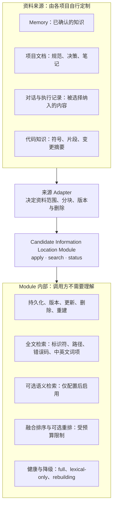
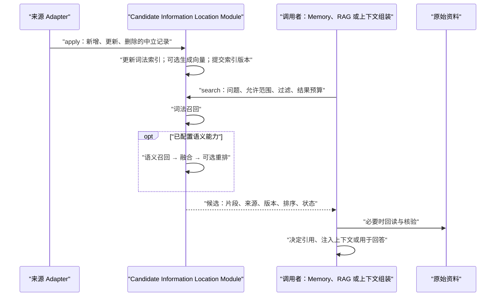
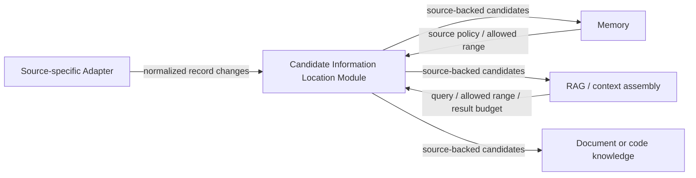

# Candidate Information Location Module

> Status: **Candidate target-module design — pending Personal Developer review**
> Date: 2026-07-27
> Scope: a local, embedded, reusable capability for locating source-backed
> candidate information. This is not yet part of Chymia's canonical Module map
> and does not amend the current Memory design.

## 1. Decision and purpose

Serious Agent systems need a way to locate a small number of relevant,
verifiable pieces of information from a larger body of material. This is a
general capability, not a Memory-only feature and not a synonym for RAG.

The Candidate Information Location Module accepts records which another Module
has already selected and made available for indexing. It returns a bounded,
ordered list of candidate records with their source reference and source
revision. The caller may then read the original material, assemble context,
present citations, or decide that a result is not usable.

The Module is intended to give Memory, RAG, context assembly, project-document
search, and code-knowledge search the same retrieval capability without making
them each implement text indexing, semantic retrieval, fusion, result
provenance, deletion, recovery, and degraded operation.

It does **not** decide which material is true, what becomes Memory, who is
allowed to read a source, whether a result authorizes an action, or what answer
an Agent should generate.

## 2. Product shape: light, not thin

The desired shape follows a small-facade, deep-Implementation approach:

```text
callers: apply record changes · search candidates · inspect status
                    |
                    v
Implementation: persistence · lexical retrieval · optional semantic retrieval
                fusion · optional rerank · consistency · recovery · rebuild
```

"Light" has these concrete meanings:

- embedded in the host process or an explicitly controlled local library;
- no required daemon, port, CLI, MCP server, HTTP endpoint, cloud account, or
  network access;
- lexical retrieval works without an embedding or reranking model;
- semantic retrieval and reranking are optional enhancements, loaded only when
  an actual deployment configures and invokes them;
- callers do not pay a public-interface cost for BM25 parameters, vector
  dimensions, RRF constants, model paths, storage tables, or backend-specific
  scores.

"Not thin" means that record identity, revisions, deletion, bounded output,
provenance, deterministic ordering, visible degradation, and rebuild are all
part of the first complete capability. They are not deferred happy-path gaps.

### Architecture at a glance



### Retrieval and use flow



## 3. Responsibility and exclusions

### The Module is responsible for

- applying idempotent, versioned changes to searchable records;
- maintaining a rebuildable local derived index;
- lexical candidate retrieval as the reliable minimum path;
- optional semantic retrieval, fusion, and bounded reranking;
- hard filtering of the ranges and attributes supplied by the caller;
- deterministic, bounded candidate results with source references;
- explicit health, index-version, rebuilding, and degraded state.

### The Module is not responsible for

- discovering files, scanning repositories, watching directories, fetching a
  URL, or reading a source again after it has been located;
- authorization, identity, Local Project selection, or Memory admission;
- document parsing, OCR, generic ETL, or deciding how Markdown, messages, and
  code should be chunked;
- answer generation, prompt construction, citation presentation, or context
  budget allocation across multiple sources;
- CLI, MCP, HTTP, a plugin marketplace, a background service, or a default
  model runtime;
- distributed indexing, multi-tenant operation, cloud synchronization, or a
  general query language.

These exclusions keep the Interface domain-neutral and preserve Locality. A
source-specific Adapter knows the source's access rules and meaningful content
boundaries; an upper Module knows whether a result may enter its context.

## 4. Interface

The proposed external Interface has three operations.

```ts
type SourceReference = {
  sourceId: string;
  revision: string;
  contentHash: string;
  locator: string;
};

type SearchRecord = {
  recordId: string;
  collection: string;
  text: string;
  source: SourceReference;
  attributes: Record<string, string | number | boolean | readonly string[]>;
};

type IndexChange =
  | { kind: "upsert"; record: SearchRecord }
  | { kind: "delete"; collection: string; recordId: string };

type SearchRequest = {
  query: string;
  collections: readonly string[];
  filter?: Readonly<Record<string, string | number | boolean | readonly string[]>>;
  maxCandidates: number;
  maxCharacters: number;
  freshness?: "allow-current" | "require-fully-indexed";
};

type Candidate = {
  recordId: string;
  excerpt: string;
  source: SourceReference;
  attributes: SearchRecord["attributes"];
  rank: number;
  channels: readonly ("lexical" | "semantic" | "rerank")[];
};

type SearchResult = {
  candidates: readonly Candidate[];
  indexVersion: string;
  state: "full" | "lexical-only" | "rebuilding" | "partial";
  notices: readonly string[];
};

interface CandidateInformationLocator {
  apply(changes: readonly IndexChange[]): Promise<{ indexVersion: string; state: "full" | "lexical-only" }>;
  search(request: SearchRequest): Promise<SearchResult>;
  status(): Promise<{ indexVersion: string; state: "ready" | "lexical-only" | "rebuilding" | "unavailable" }>;
}
```

This is an illustrative Interface contract, not an implementation declaration.
The final TypeScript names may change without changing the behaviour described
below.

### 4.1 Interface invariants

1. `recordId` is stable and unique within a collection. Repeating an identical
   upsert is idempotent. An upsert of the same record identity replaces the old
   search representation rather than creating another candidate.
2. A record requires searchable text, a source identity, a source revision, a
   content hash, and a locator. A result without a way to identify its source
   is not a formal candidate.
3. An `apply` batch is atomically visible: a search sees either the index before
   the batch or the index after the complete batch, never a partial mix.
4. A successful delete makes the record unavailable to every retrieval channel.
   Physical compaction may be delayed, but logical exclusion is immediate.
5. A request must name one or more collections. The Module never turns an empty
   range into an implicit search across all material.
6. Collection and metadata filtering are hard constraints, enforced before a
   candidate can be returned. Fusion and reranking cannot bypass them.
7. Results are de-duplicated and ranked in final relevance order. Ties use a
   stable rule so the same index version and request are reproducible.
8. `maxCandidates` and `maxCharacters` are hard upper bounds. The
   Implementation may retrieve a larger private candidate window, but never
   returns more than the stated result budget.
9. `rank` is meaningful only within one result. It is not a truth score or a
   cross-query confidence measure.
10. Empty results, degraded retrieval, rebuilding, and unavailable retrieval
    are distinct observable outcomes.

## 5. Data flow and Adapter seams



### Source-specific Adapter

The source-specific Adapter is outside the external Interface. It has real
variation and therefore is a justified Seam:

- a Markdown Adapter selects sections and headings;
- a code Adapter selects function/class/symbol units;
- a conversation Adapter selects messages or summaries that its caller has
  chosen to index;
- a Memory Adapter maps accepted knowledge to records.

The Adapter decides source access, source revision, meaningful chunk boundaries
and which attributes are supplied. It emits explicit upserts and deletes; the
absence of a record from a partial batch never implies deletion.

### Internal Implementation seams

The Module may use internal seams for storage, lexical indexing, embeddings,
vector indexing, reranking, and text processing. These seams are private to its
Implementation and its tests. Consumers do not orchestrate them.

An embedding Adapter is justified because real deployments may choose no
embedding, a local model, or another configured provider. A model identity and
vector version must accompany the derived index; incompatible model changes
require a controlled re-index rather than mixing vector spaces.

The first lexical path must remain available without this Adapter. Reranking
operates only on a bounded candidate window and may fail open to the fused or
lexical result with explicit state.

## 6. Retrieval behaviour

The minimum reliable path is lexical retrieval, suitable for exact identifiers,
paths, function names, configuration keys, error codes, and code-like text.
It must account for Chinese and mixed Chinese/code text through an evaluated
tokenization policy.

When configured, semantic retrieval obtains a query embedding and retrieves a
separate candidate list. Hybrid retrieval fuses lexical and semantic rank lists;
RRF is the default candidate fusion rule unless evaluation demonstrates another
rule is better. An optional reranker may reorder only the finite fused window.

The public Interface does not expose a switch for implementation details. It
reports the channels actually used and its state. This preserves the ability to
improve search quality without changing callers.

## 7. Consumer use

| Consumer | It contributes | It receives | It remains responsible for |
|---|---|---|---|
| Memory | accepted Memory and selected source-document records | scoped candidates with revisions | admission, correction, withdrawal, scope policy |
| RAG | permitted document records | candidate excerpts and source references | answer generation, citations, final context composition |
| Context assembly | selected Local Project or Thread material | bounded relevant candidates | current-context policy and token allocation |
| Document/code knowledge | normalized records derived from source material | candidates to inspect or display | source discovery, parsing, raw-file read-back |

The same collection mechanism supports these consumers without giving the
Module terms such as Memory Candidate, Thread, Run, Agent Invocation, or Coding
Agent CLI.

## 8. Lifecycle, failure and recovery

`apply` has two valid completion states:

- `full`: lexical and configured semantic projections are ready at the returned
  index version;
- `lexical-only`: the textual projection is durable and searchable, while the
  semantic projection is absent, unavailable, or still pending.

When a source changes, its Adapter emits replacement changes for the affected
records. When a source is withdrawn or access is revoked, the Adapter emits
deletes. The Module must not return those records after delete commit, including
after restart or rebuild.

The index is derived data. A rebuild derives all index projections from the
currently supplied record set and never invents source content. During rebuild,
the Module either serves a known complete earlier index version with visible
state, serves lexical-only results with visible state, or reports unavailable.
It does not return an unlabelled empty array.

Storage failure, malformed record changes, a rejected stale write, or a request
with no search range are typed failure states rather than empty search results.

## 9. Acceptance specification

### Hard correctness gates

| Scenario | Required result |
|---|---|
| exact identifier, path, error code, or code symbol query | correct record is rank 1 |
| range/collection filtering with highly similar cross-range content | zero cross-range results |
| updated record | current revision is returned; superseded revision is not presented as current |
| delete, withdrawal, or access revocation | zero returned records after commit, restart, and rebuild |
| repeated change batch | no duplicate record/candidate |
| failed batch | no partially visible index state |
| no embedding or unavailable vector path | lexical results remain usable and state is `lexical-only` |
| empty corpus or no match | successful empty result, distinct from unavailable/degraded |

### Quality and operating evidence

The benchmark must be versioned, human-reviewed and divided into development,
calibration, and blind final subsets. It must contain real or safely de-identified
material across these slices:

- exact identifiers and code symbols;
- paraphrases and alternate terminology;
- Chinese text;
- Chinese requests paired with English code symbols;
- near duplicates and conflicting statements;
- version histories, deletion, scope/range filtering, empty results, and
  semantic-path failure;
- 100-record development, 10,000-record normal, and 100,000-record resource
  trend corpora.

Report Recall@10 and nDCG@10 for the relevant/semantic slices, but do not let
averages override hard gates. Candidate thresholds for the first acceptance
decision are Recall@10 >= 0.90 and nDCG@10 >= 0.85; each of the Chinese,
paraphrase, and Chinese-plus-code slices must be within ten percentage points
of the total. These are candidate thresholds to calibrate against the first
real corpus, not unsupported production claims.

The benchmark records the exact corpus version, dependency versions, host,
configuration, query, and raw top-k result. The final blind set is not used for
parameter selection. A route cannot gain advantage through query rewriting,
reranking, or extra source data that another compared route did not receive.

### Embedded-lightweight verification matrix

Before selecting an Implementation, compare at least SQLite FTS5-only, SQLite
FTS5 plus sqlite-vec, and Orama behind the same thin experimental Interface;
QMD is a quality baseline, not a default dependency. Verify on the target
Windows environment:

- clean install and native extension loading;
- no daemon, listening port, CLI bootstrap, network access, or required model
  download for lexical-only operation;
- cold start to first query for empty and normal indexes;
- disk, WAL/temporary-file, and index-size growth;
- idle and query/ingestion memory;
- create, update, delete, reinsert, restart, failure interruption, and rebuild;
- deterministic filtering before top-k truncation;
- Chinese paths and non-ASCII records.

Resource figures become release gates only after they are measured on the real
host and an explicit budget is accepted. Until then, the test records curves
rather than pretending that a universal millisecond or megabyte target exists.

## 10. Current Chymia relation

`packages/api/src/evidence/sqlite-evidence-store.ts` demonstrates useful local
mechanisms: SQLite FTS5, Jieba tokenization, sqlite-vec storage, RRF, and
lexical degradation. It is not this Module's Interface or target
Implementation. It currently uses Chymia Evidence types and derives a query
vector from a lexical hit rather than generating a real query embedding. It
therefore cannot establish general semantic retrieval and must not be extracted
unchanged.

The current canonical Memory target names QMD and a SQLite lexical fallback as
its retrieval mechanism. This candidate design deliberately does not replace
that decision. Before canonical adoption, the Module's evaluation evidence must
show that it satisfies the stated acceptance specification and the architecture
map plus Memory design must be reconciled together.

## 11. Decisions deliberately deferred

- the first production Implementation: SQLite composition, Orama, or another
  evaluated route;
- the precise Chinese and code tokenization policy;
- whether the first production release includes a configured semantic Adapter;
- whether a reranker earns its cost on the benchmark;
- actual cold-start, latency, memory, and disk budgets for the target host;
- which source-specific Adapters are justified by confirmed consumers.

These are evidence-dependent implementation decisions. They do not change the
Module's Interface, its exclusions, or the acceptance gates above.
